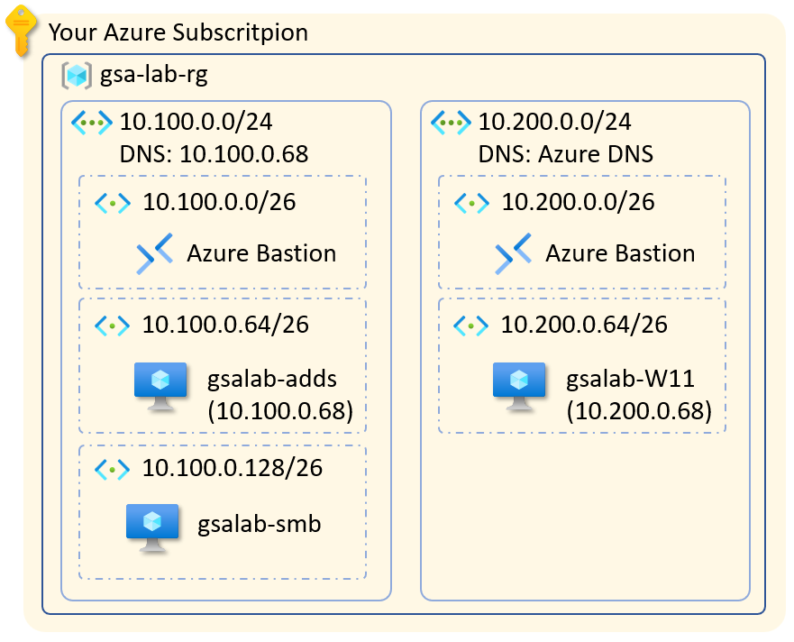

# Microsoft Entra Global Secure Access Labs for infrastructure
This repository aims to provide an infrastructure foundations for Microsoft Entra Global Secure Access labs.

## Changelog
- 2025-01-20 Adding VM Size SKU paramter to be flexible in chosing your deployment. Updates to the readme.

# What will be deployed
This pattern deploys the following infrastructure components:

> NOTE: The IP Addresses for the virtual networks are hard coded in the tempalte. We recommend to use the defaults, but if you want to change these do that in [./networking/networking.bicep](./networking/networking.bicep) and [./networking/updateDNS.bicep](./networking/updateDNS.bicep) files. Please note that this script creates compeltely isolated virtual networks, not connected to any other existing resources, there will be no conflicts with your existing virtual networks.

* A resource group which holds all the components
* A Virtual Network for the servers which includes
  * IP address space `10.100.0.0/24`
  * Azure Bastion to connect to the VMs (subnet `10.100.0.0/26`)
  * Subnet (`10.100.0.64/26`) for the AD DS. There we place one VM with Windows Server 2022. This VM is automatically promoted to AD DS primary domain controller. After the VM is promoted to AD DS, the **DNS** server for the VNet is set to its IP address - `10.100.0.68`
  * Subnet (`10.100.0.128/26`) for secondary VM with Windows Server 2022. This VM will be automatically joined to the domain and will be used to simulate file share server and IIS Web Server.
* A Virtual Network for client VM which includes
  * IP address space `10.200.0.0/24`
  * Azure Bastion to connect to the client VM (subnet `10.200.0.0/26`). Because we want to test Entra Private access, we must avoid connecting the client VM directly to the Server VMs via Azure Virtual Network Peering. That is why we need a separate Azure Bastion deployment for this isolated network.
  * A subnet (`10.100.0.64/26`) with single Windows 11 VM
* A virtual Network for hybrid client tests which includes
  * IP Address space `10.150.0.0/24`
  * A DNS set to the AD DS to facilitate Enterprise Join
  * A subnet `10.150.0.0/25` and one W11 client deployed there
  * A VNet peering from hybrid client VNet to Servers VNet to enable the use of Azure Bastion from Servers VNet to connect to the hybrid client and to enable domain join.

When done, you must see the following components in your resource group:


> Note: The deplyoment takes time. Especially promoting the VM to primary domain controller. Be patient and wait for the result. 

# Parameters file
All the parameters are located in the [lab.bicepparam](./lab.bicepparam) file. You can use the default values for most of them.

* **tags** The Azure tags to applied to the resource group and the resources created.
* **vmSize** The Azure VM Size SKU that will be used to deploy all the VMs. The default value is [Standard_D4ads_v5](https://learn.microsoft.com/en-us/azure/virtual-machines/sizes/general-purpose/dasv5-series?tabs=sizebasic). You may need to check for availability in your chosen region (refer to the [Azure Products by Region](https://azure.microsoft.com/en-us/explore/global-infrastructure/products-by-region/table) table). Please pay attention that we use Standard SSD LRS disks on the VM, so chose a [VM size](https://learn.microsoft.com/en-us/azure/virtual-machines/sizes/overview) that supports Standard SSD disks. You must also pay attention to the requirements for accelerated networking. Some newer VM generations **require** accelerated networking. These will not work with the current scripts, as we do not activate the accelerated networking by default.
* **resourceLocation**  Azure region where all the resources shall be created. Pay attention to [location availability of Azure Bastion](https://azure.microsoft.com/en-us/explore/global-infrastructure/products-by-region/table) and chose location where you can create Azure Bastion. Otherwise your deployment will fail.
* **resourceGroupName** name of the resource group to be created. Note that all resources will be created in this resource group
* **adminUsername** the login name for the local administrator account. It will be same across all virtual machines. Note that this will also be your Enterprise Administrator account for the AD DS. This login name can only be used to login to the VMs over Azure Bastion resp. RDP. 
* **adminPassword** Please chose a secure complex password that would comply with both Azure VM password requriements and AD DS default password requirements to avoid deployment failures.
* **adDomainName** This will be the name of your AD DS domain. 

# How to deploy
To deploy your infrastructure you must clone the entire repository and execute az cli deployment command point it to the [main.bicep](./main.bicep) file and [lab.bicepparam](./lab.bicepparam) file
The easiest way to achieve that is following these steps:
> Note: Your subscritpion might be missing some Azure VM resource provider feature (`EncryptionAtHost`). To make sure the deployment will succeeed, pelase first register the feature with your subscription by executing the following command: `az feature register --namespace Microsoft.Compute --name EncryptionAtHost`

* Open you favorite browser window, navigate to (https://portal.azure.com) and sign-in with your Azure account where you want to create the lab environment
* Open the cloud shell from top right button. For more information Azure Cloud Shell follow [this link](https://learn.microsoft.com/en-us/azure/cloud-shell/overview). Please choose `Azure Bash` mode
* clone this repository by executing the following command in the cloud shell:
   ```
   git clone https://github.com/Dayzure/entra-gsa-labs.git
   ```
* once the repository is cloned you can change to its locally create folder:
   ```
   cd entra-gsa-labs
   ```
* The only thing left is to update the password, and optionally the VM size SKU, in the parameters file. You can do this using the built-in code editor. To start the local editor type the following command in the Azure Cloud Shell:
  ```
  code lab.bicepparam
  ```
  To save your changes you can use the editor commands. Follow the reference [here](https://learn.microsoft.com/en-us/azure/cloud-shell/using-cloud-shell-editor)
* In your last step you will deploy the entire infrastructure in one single go by executing the following command from the cloud shell:
  * before running the deployment make sure you are targeting the subscritpion you want to deploy to. Check the current context using the command
  ```
  az account show
  ```
  * should you have access to multiple subscriptions and the above command shows you different subscription, change the context using the command:
  ```
  az account set --subscription "<GUID or Name of the Azure subscription>"
  ```
  * (optional, but recommended) re-register the `EncryptionAtHost` feature with Azure VM resoucce provider (`Microsoft.Compute`) by running the follwing command:
  ```
  az feature register --namespace Microsoft.Compute --name EncryptionAtHost
  ```
  * Finally run the deployment command
  ```
   az deployment sub create -n 'gsaLabvnet' -l 'westeurope' --template-file 'main.bicep' --parameters 'lab.bicepparam'
  ```

Now sit back and relax untill deplyoment completes.
Once your deployment if finished you can connect to any of the VMs using Azure Bastion. 

After you perform the steps above your deployment is ready and you can continue to fine tune.

> Note: Because the default configuration of Azure VMs is to only allow remote log on via Remote Desktop Services to the Administrators group, you will need to tweak the security policy. You must add the Remote Desktop Users security group to the local security policy. Untill we fix that with DSC.

# TODOs
- [X] Remove the public IPs and validate deplyoment
- [X] Optimize NSGs - actually removed all NSGs as we do not need them. All comms are within the same virtual network
- [X] Try to run the group and user creation and folder share [script](./PoSH/CreateFileShare.ps1) as part of the deployment. For now user must manually execute it on the smb VM after deployment is ready. 
 - https://github.com/Dayzure/entra-gsa-labs/issues/2
- [X] Add another client that will be Hybrid Joined 
 - https://github.com/Dayzure/entra-gsa-labs/issues/1
 - [X] Install IIS Web service using DSC
 - [ ] Deploy 3 web applications to the IIS as part of the deployment script. Use PowerShell extension to run a powershell that will download und unzip ASP.NET apps.
 - [ ] work out automation to simulate the client being in "local" network and sometimes being "on internet". Ref.: https://github.com/Dayzure/entra-gsa-labs/issues/3
 - [ ] enforce accelerated networking on all the VMs and include notes about the VM Size requriements regarding that. Ref.: https://github.com/Dayzure/entra-gsa-labs/issues/7
 - [ ] add PowerShell script to be manually executed on the domain controller. The script shall include the policy to allow log-on via remote desktop services to the Remote Desktop Users group and the newly created security group.
 
# Most common issues when running the script
The most common issue when running the script is the regional constraints for VM Size SKU. The error message will look something like this (some texts omitted and line breaks added for clarity):
```
{"status":"Failed","error":{"code":"DeploymentFailed", ....
   .... 
   [{"code":"SkuNotAvailable","message":"The requested VM size for resource 'Following SKUs have failed for Capacity Restrictions: Standard_D4s_v3' is currently not available in location 'westeurope'. Please try another size or deploy to a different location or different zone. See https://aka.ms/azureskunotavailable for details."}]}]}]}]}}
```
If you encounter such error message, please adjust the region and/or the VM Size SKU (`vmSize` parameter) in the [lab.bicepparam](https://github.com/Dayzure/entra-gsa-labs/blob/a8e1457c76b7c682b5c46e9c778fadfb9d7b9c5a/lab.bicepparam#L10) file.
