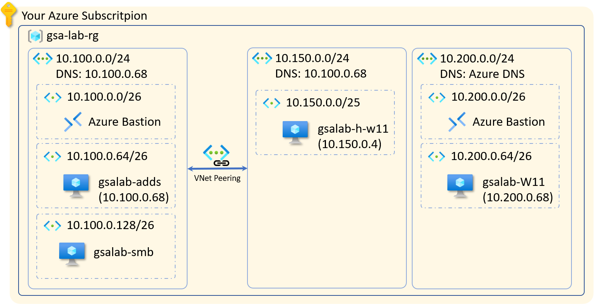

# Microsoft Entra Global Secure Access Labs for infrastructure
This repository aims to provide an infrastructure foundations for Microsoft Entra Global Secure Access labs.

# What will be deployed
This pattern deploys the following infrastructure components:

> NOTE: The IP Addresses for the virtual networks are hard coded in the tempalte. We recommend to use the defaults, but if you want to change these do that in [./networking/networking.bicep](./networking/networking.bicep) and [./networking/updateDNS.bicep](./networking/updateDNS.bicep) files. Please note that this script creates compeltely isolated virtual networks, not connected to any other existing resources, there will be no conflicts with your existing virtual networks.

* A resource group which holds all the components
* A Virtual Network for the servers which includes
  * IP address space `10.100.0.0/24`
  * Azure Bastion to connect to the VMs (subnet `10.100.0.0/26`)
  * Subnet (`10.100.0.64/26`) for the AD DS. There we place one VM with Windows Server 2022. This VM is automatically promoted to AD DS primary domain controller. After the VM is promoted to AD DS, the **DNS** server for the VNet is set to its IP address - `10.100.0.68`
  * Subnet (`10.100.0.128/26`) for secondary VM with Windows Server 2022. This VM will be automatically joined to the domain and will be used to simulate file share server.
* A Virtual Network for client VM which includes
  * IP address space `10.200.0.0/24`
  * Azure Bastion to connect to the client VM (subnet `10.200.0.0/26`). Because we want to test Entra Private access, we must avoid connecting the client VM directly to the Server VMs via Azure Virtual Network Peering. That is why we need a separate Azure Bastion deployment for this isolated network.
  * A subnet ()`10.100.0.64/26`) with single Windows 11 VM

When done, you must see the following components in your resource group:

> Note: The deplyoment takes time. Especially promoting the VM to primary domain controller. Be patient and wait for the result. 

# Parameters file
All the parameters are located in the [lab.bicepparam](./lab.bicepparam) file. You can use the default values for most of them.

* **tags** The Azure tags to applied to the resource group and the resources created.
* **resourceLocation**  Azure region where all the resources shall be created. Pay attention to [location availability of Azure Bastion](https://azure.microsoft.com/en-us/explore/global-infrastructure/products-by-region/table) and chose location where you can create Azure Bastion. Otherwise your deployment will fail.
* **resourceGroupName** name of the resource group to be created. Note that all resources will be created in this resource group
* **adminUsername** the login name for the local administrator account. It will be same across all virtual machines. Note that this will also be your Enterprise Administrator account for the AD DS. This login name can only be used to login to the VMs over Azure Bastion resp. RDP. 
* **adminPassword** Please chose a secure complex password that would comply with both Azure VM password requriements and AD DS default password requirements to avoid deployment failures.
* **adDomainName** This will be the name of your AD DS domain. 

# How to deploy
To deploy your infrastructure you must clone the entire repository and execute az cli deployment command pointint to the [main.bicep](./main.bicep) file and [lab.bicepparam](./lab.bicepparam) file
The easiest way to achieve that is following these steps:
* Open you favorite browser window, navigate to (https://portal.azure.com) and sign-in with your Azure account where you want to create the lab environment
* Open the cloud shell from top right button. For more information Azure Cloud Shell follow [this link](https://learn.microsoft.com/en-us/azure/cloud-shell/overview). Please choose `Azure Bash` mode
* clone this repository by executing the following command in the cloud shell:
 `git clone https://github.com/Dayzure/entra-gsa-labs.git`
* once the repository is cloned you can change to its locally create folder:
 `cd entra-gsa-labs`
* The only thing left is to update the password in the parameters file. You can do this using the built-in code editor. To start the local editor type the following command in the Azure Cloud Shell:
`code lab.bicepparam`
 In order to save your changes you can use the editor commands. Follow the reference [here](https://learn.microsoft.com/en-us/azure/cloud-shell/using-cloud-shell-editor)
* In your last step you will deploy the entire infrastructure in one single go by executing the following command from the cloud shell:
`az deployment sub create -n 'gsaLabvnet' -l 'westeurope' --template-file 'main.bicep' --parameters 'lab.bicepparam'`
* Once your deployment if finished you can connect to any of the VMs using Azure Bastion. To finish this deplyoment you must manually perform one last step: 
  * login to the `smb` VM and execute the [CreateFileShare.ps1](./PoSH/CreateFileShare.ps1) file. You can simply copy the content of the file and paste it in PowerShell within the VM. It is important to execute this script in the context of the administrator account (the parameters provided in the param file).

After you perform the steps above your deployment is ready and you can continue to fine tune.

# TODOs
- [X] Remove the public IPs and validate deplyoment
- [X] Optimize NSGs - actually removed all NSGs as we do not need them. All comms are within the same virtual network
- [ ] Try to run the group and user creation and folder share [script](./PoSH/CreateFileShare.ps1) as part of the deployment. For now user must manually execute it on the smb VM after deployment is ready.
- [ ] Add another client that will be Hybrid Joined 
 - https://github.com/Dayzure/iga-demos/issues/1
 - [ ] work out automation to simulate the client being in "local" network and sometimes being "on internet"
